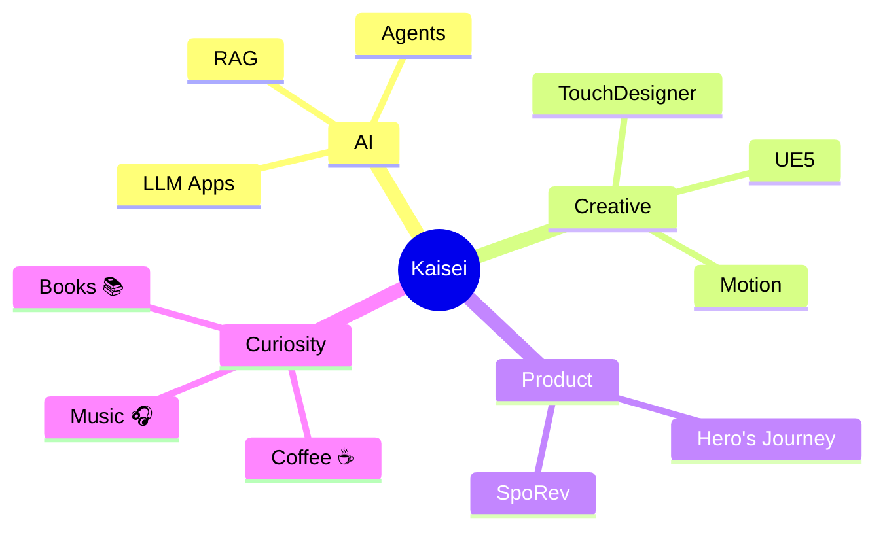

<div align="center">


<a href="https://github.com/ohtakaisei">
  
</a>

<br/>


</div>

<br/>

## 🌌 About Me

```yaml
名前:        大田 海聖 (Kaisei Ohta)
所在地:      🗼 Tokyo, Japan
肩書き:      Creative Technologist / AI Engineer
関心:        [ "Generative AI", "Real-time Graphics", "Interactive Art" ]
モットー:    "七転び百起き"
今ハマってる: ☕ + 🎧 + ⌨️
```

<br/>

## 🚀 What I Do

<table>
<tr>
<td width="33%" valign="top">

### 🎨 Creative Tech
インタラクティブアートと  
リアルタイムビジュアル  
`TouchDesigner` `UE5`

</td>
<td width="33%" valign="top">

### 🤖 AI Engineering
RAGシステム、自律エージェント、  
生成AIアプリの開発  
`LangChain` `Python` `LLMs`

</td>
<td width="33%" valign="top">

### 🎬 Digital Media
映像編集とモーショングラフィックス  
`Premiere Pro` `After Effects`

</td>
</tr>
</table>

<br/>

## 🛠 Tech Stack

<div align="center">

**Languages**  


**Frameworks & Libraries**  


**Creative & Cloud**  


</div>

<br/>

## 🔭 Currently Working On

> 🏀 **[SpoRev](https://github.com/ohtakaisei/sports_review)** — バスケットボール選手レビューに特化したプラットフォーム  
> ⚔️ **[AI先生](https://github.com/ohtakaisei/AI-teacher)** — AIの先生が指導してくれるサイト  
> 🧪 **[LifeFlow](https://github.com/ohtakaisei/Life-flow-ios)** — 生活管理iOSアプリ
> その他

<br/>

## 📊 GitHub Stats

<div align="center">


<br/>


<br/><br/>


</div>

<br/>

## 🌱 Now & Next



<br/>

## 📫 Connect with Me

<div align="center">

<a href="https://www.linkedin.com/in/ohtakaisei">
  
</a>
<a href="mailto:your-email@example.com">
  
</a>
<a href="https://github.com/ohtakaisei">
  
</a>

</div>

<br/>

<div align="center">

> *「技術は道具、創造は意志。」*


</div>
